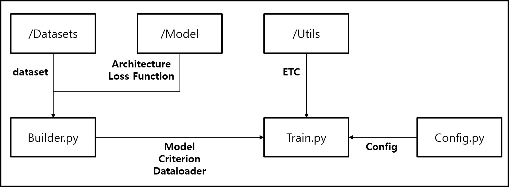

# Torch Template
This is the ResNet code based on Pytorch adn DDP.  
I hope you use this as template.  

 
 
 

## Dependency
* python = 3.6  
* Torch  = 1.10.2  
 
 
 

## Structure
  
 
 
 

## Dataset
This spport only imagenet1K and requires json file (made by me).  
https://drive.google.com/drive/folders/1a3RNh3Fmsu2YSamCqnxnAmyew1uBFDgR?usp=sharing
 
 
 

## Model Zoo 
* Baseline
  * base_aug + StepLR(0.1,30) + SGD + Batch_256 + epoch_90 + size_224
  * top1=76.15, top5=92.98, 37~38 ms/iter, 7113MiB
  * https://drive.google.com/drive/folders/17mA9W2ENfaj7PaTl-MpPru2mB0t4SRQv?usp=sharing
* + MixedPrecision
  * top1=76.06, top5=92.87, 33~34 ms/iter, 4618MiB
  * https://drive.google.com/drive/folders/1DFUDE7WNYTEoKsEC41pNeGCMvY-q_x1c?usp=sharing
